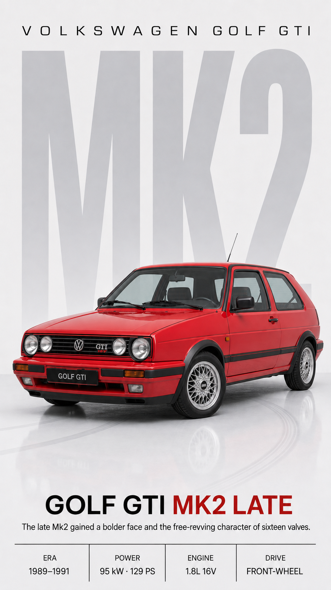
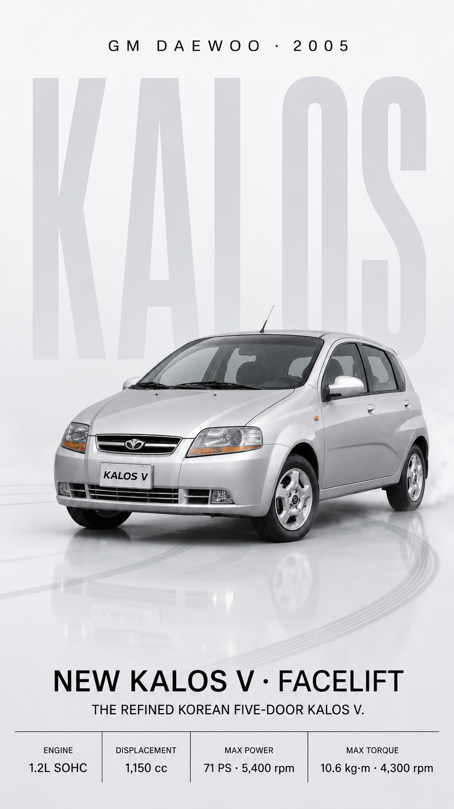
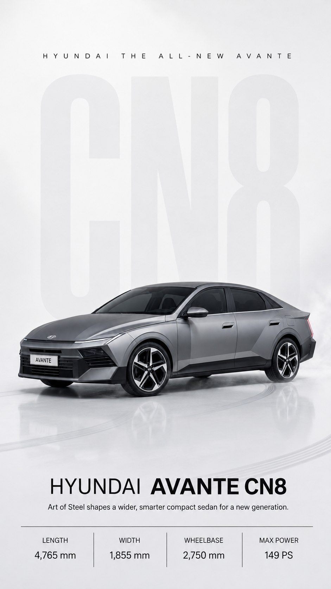

# my-dream-car

`my-dream-car` researches the exact real-world vehicle requested by the user and creates a premium vertical automotive poster while prioritizing vehicle identity, generation/facelift fidelity, and series layout consistency.

## Core behavior

- confirms reference-image availability and exterior color before the first image unless already specified
- prioritizes user-confirmed reference images
- researches recent, obscure, regional, or facelift-sensitive vehicles actively
- records and filters reference provenance
- quarantines conflicting visual references before image generation
- creates and validates a multi-angle shape anchor before the final poster when strict grounding is needed
- treats distinctive fender volume and side-body surface geometry as identity-critical when supported by research
- distinguishes local repair from identity-critical regenerate-from-scratch cases
- verifies poster specifications conservatively
- keeps paired or multi-poster layouts aligned through a shared layout anchor
- locks all vehicles in a poster series to the same front three-quarter direction, with the nose toward canvas left by default
- uses the vehicle's short name on the showroom-style front plate unless the user asks otherwise

## Package structure

- `SKILL.md` — primary skill instructions
- `assets/poster-style-reference.png` — poster composition/style reference
- `references/intake-questionnaire.md` — initial clarification routine
- `references/research-playbook.md` — research, provenance, and reference filtering rules
- `references/anchor-prompt.md` — shape-anchor generation template
- `references/repair-prompt.md` — localized repair template
- `references/poster-prompt.md` — final poster prompt template
- `references/paired-variant-workflow.md` — rules for pre-/post-facelift and related variants
- `references/layout-consistency-spec.md` — fixed-layout rules for poster sets
- `templates/` — structured research and validation templates
- `tests/` — manual and regression tests
- `docs/failure-lessons-kalos.md` — lessons from the Kalos regression case
- `docs/design-notes.md` — current design rationale

## Poster style

The default composition uses a bright studio background, large pale background typography, a front three-quarter hero vehicle, subtle floor reflection, a lower title/description block, and a four-cell specification strip.

Vehicle fidelity always takes priority over decorative styling.

## Example outputs

  
  
  

| Volkswagen Golf GTI Mk2 Late | GM Daewoo Kalos V Facelift | Hyundai Avante CN8 |
|---|---|---|
| late Mk2 GTI example poster | Korean-market Kalos V facelift example poster | new-generation Avante CN8 example poster |
